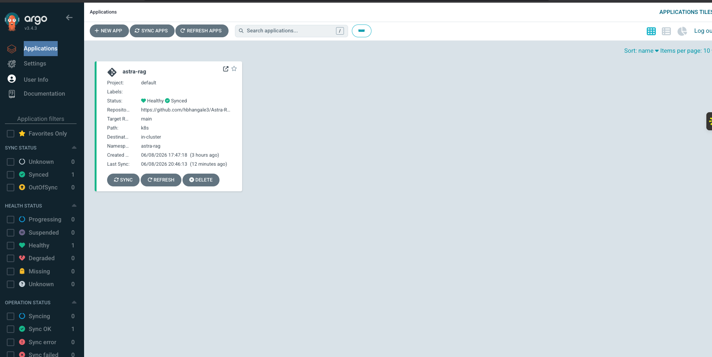
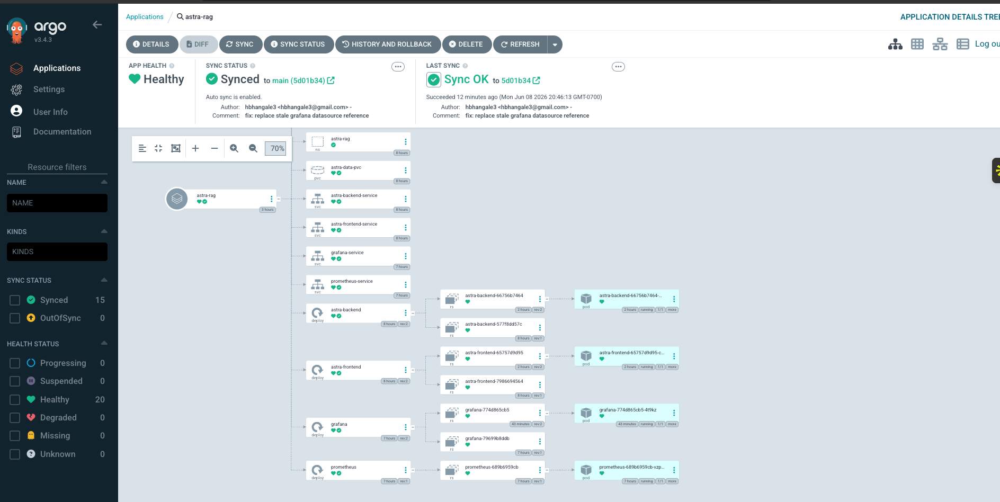
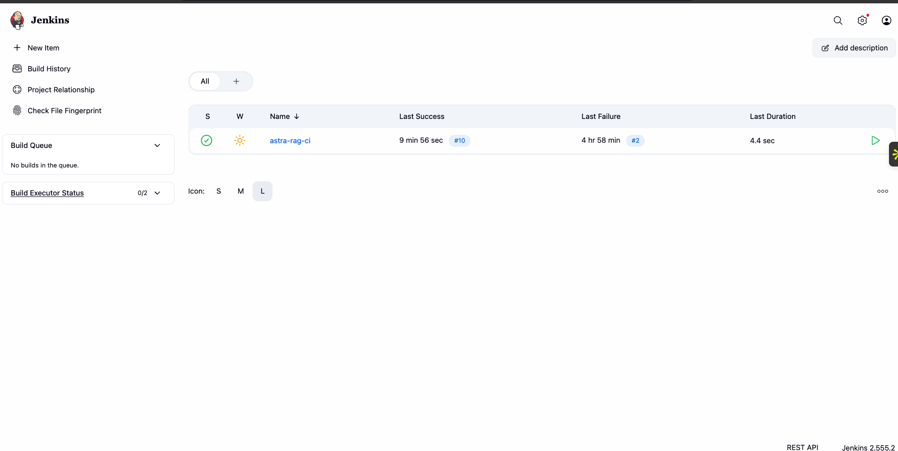
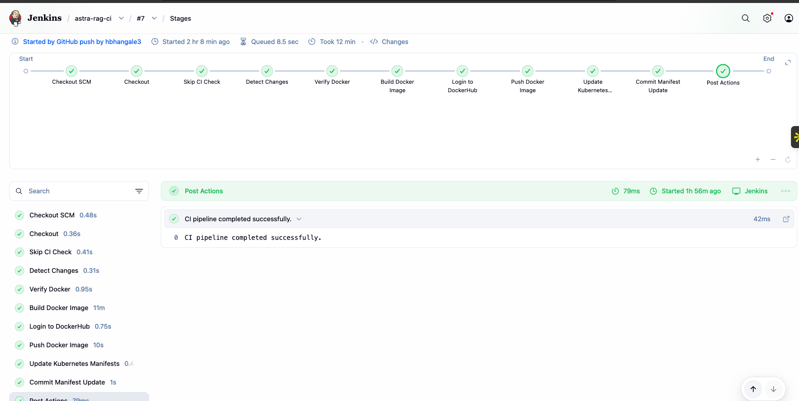
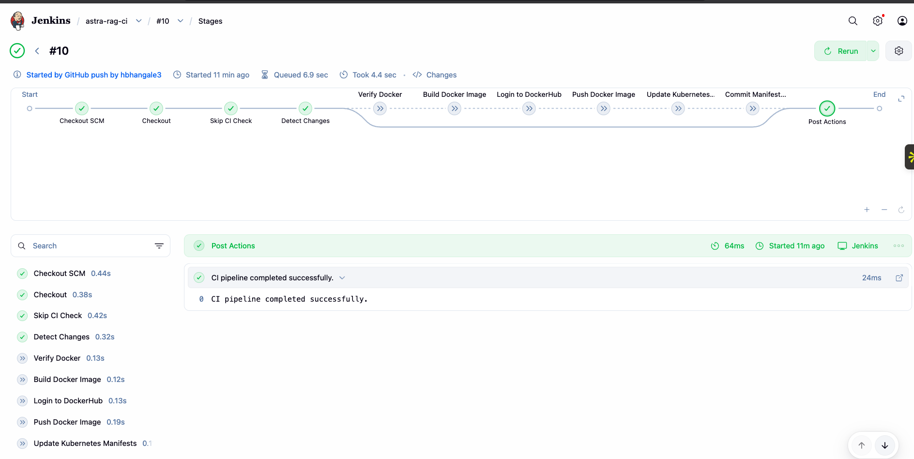
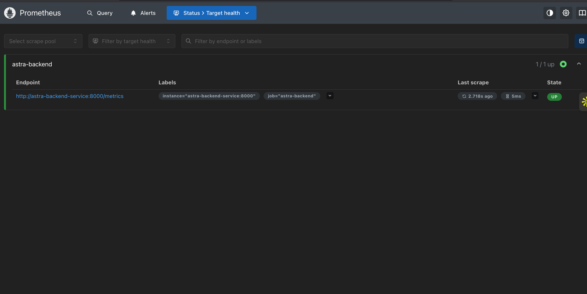
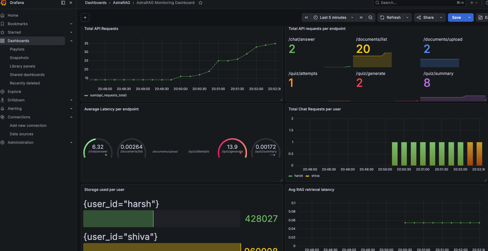

# AstraRAG — Agentic RAG Study Buddy AI

AstraRAG is a full-stack **Agentic Retrieval-Augmented Generation Study Buddy** application that allows users to upload study material, chat with their documents, generate source-grounded quizzes, track quiz performance, and monitor system behavior using Prometheus and Grafana.

This project is not only a RAG chatbot. It is a complete cloud-native GenAI application covering:

- Streamlit frontend
- FastAPI backend
- User authentication
- Document upload and ingestion
- User-specific persistent document storage
- ChromaDB vector database
- LlamaIndex retrieval pipeline
- CrewAI agent orchestration
- Quiz generation and scoring
- Prometheus metrics
- Grafana dashboard provisioning
- Docker and Docker Compose
- Kubernetes deployment
- Jenkins CI pipeline
- ArgoCD GitOps deployment

---

## Table of Contents

- [Project Overview](#project-overview)
- [Live Application Walkthrough](#live-application-walkthrough)
- [Core Features](#core-features)
- [System Architecture](#system-architecture)
- [Tech Stack](#tech-stack)
- [Project Structure](#project-structure)
- [Local Setup with Docker Compose](#local-setup-with-docker-compose)
- [Manual Local Development Setup](#manual-local-development-setup)
- [Environment Variables](#environment-variables)
- [Cloud Deployment Overview](#cloud-deployment-overview)
- [Kubernetes and ArgoCD GitOps](#kubernetes-and-argocd-gitops)
- [Jenkins CI Pipeline](#jenkins-ci-pipeline)
- [Prometheus Monitoring](#prometheus-monitoring)
- [Grafana Dashboard Provisioning](#grafana-dashboard-provisioning)
- [Persistent Storage](#persistent-storage)
- [Service URLs](#service-urls)
- [Useful Commands](#useful-commands)
- [Troubleshooting](#troubleshooting)
- [Future Improvements](#future-improvements)
- [Author](#author)

---

## Project Overview

AstraRAG is an AI-powered study assistant.

Users can upload documents, ask questions from those documents, generate quizzes, attempt quizzes, and track progress through a dashboard.

The application uses Retrieval-Augmented Generation so that answers and quizzes are grounded in the uploaded study material.

```text
User
  ↓
Streamlit Frontend
  ↓
FastAPI Backend
  ↓
RAG / Agentic Service Layer
  ↓
ChromaDB Vector Store
  ↓
LLM
  ↓
Answer / Quiz / Dashboard Output
```

---

## Live Application Walkthrough

### 1. Home Page

The landing page introduces AstraRAG as an Agentic RAG-powered Study Buddy application.


---

### 2. User Login

Users log in before accessing personalized document storage, chat, quizzes, and dashboard views.


---

### 3. Upload Documents

Users can upload study material in supported formats. Uploaded files are stored persistently and ingested into ChromaDB.


---

### 4. Chat With Notes

The chat interface allows users to ask questions over uploaded documents. Answers are grounded in retrieved document chunks and include source attribution.


---

### 5. Generate Quiz

Users can generate quizzes from uploaded documents by selecting topic, number of questions, difficulty, and question type.


---

### 6. Attempt Quiz

Generated quiz questions are displayed as multiple-choice questions.


---

### 7. Quiz Results

After submission, users receive correct/incorrect feedback, explanations, sources, score, and percentage.


---

### 8. User Dashboard

The dashboard tracks uploaded documents, storage usage, quiz attempts, average score, best score, and recent quiz attempts.


---

## Core Features

### Document Upload and Ingestion

AstraRAG supports uploading study material and preparing it for retrieval.

Supported file types include:

- PDF
- DOCX
- PPTX
- TXT
- Markdown

Ingestion flow:

```text
Uploaded File
  ↓
Validation
  ↓
Text Extraction / Conversion
  ↓
Chunking
  ↓
Embedding Generation
  ↓
ChromaDB Storage
  ↓
Available for Chat and Quiz Generation
```

---

### Chat With Notes

The chatbot performs document-grounded question answering.

```text
User Question
  ↓
FastAPI Backend
  ↓
Retrieve Relevant Chunks
  ↓
LLM Generates Answer
  ↓
Return Answer + Sources
```

---

### Quiz Generation

The quiz generation workflow creates source-grounded questions from uploaded documents.

Users can specify:

- Topic
- Number of questions
- Difficulty
- Question type

The quiz results include:

- Selected answer
- Correct answer
- Explanation
- Source document
- Final score

---

### User Dashboard

The frontend dashboard tracks learning activity:

- Uploaded document count
- Storage used
- Storage limit
- Quiz attempts
- Average score
- Best score
- Recent quiz history

---

### Monitoring Dashboard

Backend metrics are exposed through FastAPI and scraped by Prometheus. Grafana displays operational and product-level metrics.

Examples:

- Total API requests
- API requests by endpoint
- Average latency by endpoint
- Chat requests per user
- Storage used per user
- RAG retrieval latency
- Quiz endpoint activity

---

## System Architecture

### Application Architecture

```text
Streamlit Frontend
  ↓
FastAPI Backend
  ↓
Service Layer
  ↓
CrewAI Agent / LlamaIndex Query Engine
  ↓
ChromaDB Vector Store
  ↓
LLM Provider
```

---

### RAG Pipeline

```text
User Query
  ↓
Query Embedding
  ↓
Vector Similarity Search
  ↓
Top-k Retrieved Chunks
  ↓
Prompt Construction
  ↓
LLM Generation
  ↓
Answer with Sources
```

---

### DevOps Architecture

```text
Developer Push
  ↓
GitHub Repository
  ├── Jenkins CI
  │     ├── Detect changed files
  │     ├── Build Docker image for app-code changes
  │     ├── Push image to DockerHub
  │     └── Update Kubernetes manifests with SHA image tag
  │
  └── ArgoCD GitOps
        ├── Watches k8s/ on main
        ├── Detects manifest drift
        ├── Syncs Kubernetes resources
        └── Maintains cluster desired state
```

---

### Kubernetes Runtime

```text
astra-rag namespace
  ├── astra-backend Deployment
  ├── astra-frontend Deployment
  ├── prometheus Deployment
  ├── grafana Deployment
  ├── astra-data-pvc
  ├── Services
  ├── ConfigMaps
  └── Secrets
```

---

## Tech Stack

### Frontend

- Streamlit
- Python requests
- Session state-based UI

### Backend

- FastAPI
- Uvicorn
- Pydantic
- Python service layer architecture

### RAG and Agentic AI

- LlamaIndex
- CrewAI
- ChromaDB
- HuggingFace embeddings
- OpenAI
- Groq

### Document Processing

- PDF support
- DOCX support
- PPTX support
- TXT support
- Markdown support
- MarkItDown-style document conversion workflow

### DevOps

- Docker
- Docker Compose
- Kubernetes
- Minikube
- Jenkins
- ArgoCD
- DockerHub
- GCP Compute Engine

### Observability

- Prometheus
- Grafana
- FastAPI `/metrics`

---

## Project Structure

```text
Astra_RAG/
│
├── src/
│   ├── agents/
│   │   ├── agent/
│   │   ├── tasks/
│   │   ├── tools/
│   │   ├── llm/
│   │   └── crew.py
│   │
│   ├── backend/
│   │   ├── api/
│   │   ├── services/
│   │   ├── config/
│   │   └── main.py
│   │
│   ├── frontend/
│   │   ├── pages/
│   │   ├── config/
│   │   └── app.py
│   │
│   └── rag_doc_ingestion/
│       ├── config/
│       └── ingest_doc.py
│
├── k8s/
│   ├── namespace.yaml
│   ├── astra-configmap.yaml
│   ├── astra-data-pvc.yaml
│   ├── backend-deployment.yaml
│   ├── backend-service.yaml
│   ├── frontend-deployment.yaml
│   ├── frontend-service.yaml
│   ├── prometheus-configmap.yaml
│   ├── prometheus-deployment.yaml
│   ├── prometheus-service.yaml
│   ├── grafana-deployment.yaml
│   ├── grafana-service.yaml
│   ├── grafana-datasource-configmap.yaml
│   ├── grafana-dashboard-provider-configmap.yaml
│   └── grafana-dashboard-configmap.yaml
│
├── grafana/
│   └── dashboard/
│       └── astra-rag-dashboard.json
│
├── Docs/
│   └── images/
│
├── Dockerfile
├── docker-compose.yaml
├── Jenkinsfile
├── pyproject.toml
├── uv.lock
├── run_astra.sh
└── README.md
```

---

## Local Setup with Docker Compose

This is the recommended way for users to replicate the application locally.

### 1. Clone the Repository

```bash
git clone https://github.com/hbhangale3/Astra-RAG-Chatbot.git
cd Astra-RAG-Chatbot
```

---

### 2. Create `.env`

Create a `.env` file in the project root.

```env
OPENAI_API_KEY=your_openai_api_key
GROQ_API_KEY=your_groq_api_key

OPENAI_MODEL=gpt-4o-mini
MODEL_NAME=llama-3.3-70b-versatile
MODEL_TEMPERATURE=0.2

DOCUMENTS_DIR=/app/data/docs
VECTOR_STORE_DIR=/app/data/chroma
COLLECTION_NAME=document_collection

BACKEND_BASE_URL=http://backend:8000
CREWAI_TRACING_ENABLED=false
```

---

### 3. Run with Docker Compose

```bash
docker compose up --build
```

Detached mode:

```bash
docker compose up --build -d
```

---

### 4. Open the Application

```text
Frontend: http://localhost:8501
Backend:  http://localhost:8000/docs
Metrics:  http://localhost:8000/metrics
```

---

### 5. Stop the Application

```bash
docker compose down
```

Remove volumes as well:

```bash
docker compose down -v
```

---

## Manual Local Development Setup

Use this mode if you want to run backend and frontend directly without Docker.

### 1. Create Environment

```bash
python3 -m venv .venv
source .venv/bin/activate
```

Or with `uv`:

```bash
uv sync
```

---

### 2. Create `.env`

```env
OPENAI_API_KEY=your_openai_api_key
GROQ_API_KEY=your_groq_api_key
DOCUMENTS_DIR=./Docs
VECTOR_STORE_DIR=./vectorDB
COLLECTION_NAME=document_collection
MODEL_NAME=llama-3.3-70b-versatile
MODEL_TEMPERATURE=0.2
BACKEND_BASE_URL=http://localhost:8000
```

---

### 3. Start Backend

```bash
python3 -m src.backend.main
```

Backend runs at:

```text
http://localhost:8000
```

Swagger docs:

```text
http://localhost:8000/docs
```

---

### 4. Start Frontend

```bash
streamlit run src/frontend/app.py
```

Frontend runs at:

```text
http://localhost:8501
```

---

## Environment Variables

| Variable                 | Purpose                                 |
| ------------------------ | --------------------------------------- |
| `OPENAI_API_KEY`         | OpenAI API key                          |
| `GROQ_API_KEY`           | Groq API key                            |
| `OPENAI_MODEL`           | OpenAI model used by selected workflows |
| `MODEL_NAME`             | Groq/LLM model name                     |
| `MODEL_TEMPERATURE`      | LLM generation temperature              |
| `DOCUMENTS_DIR`          | Document upload directory               |
| `VECTOR_STORE_DIR`       | ChromaDB vector store path              |
| `COLLECTION_NAME`        | ChromaDB collection name                |
| `BACKEND_BASE_URL`       | Backend URL used by frontend            |
| `CREWAI_TRACING_ENABLED` | Enables/disables CrewAI tracing         |

---

## Cloud Deployment Overview

The deployed version used:

- GCP Compute Engine VM
- Docker
- Minikube
- Kubernetes
- Jenkins container
- ArgoCD
- DockerHub
- Prometheus
- Grafana

High-level cloud flow:

```text
GitHub main branch
  ↓
Jenkins CI builds and pushes images
  ↓
DockerHub stores image tags
  ↓
Jenkins updates k8s manifests
  ↓
ArgoCD syncs manifests
  ↓
Kubernetes runs updated pods
```

---

## Kubernetes and ArgoCD GitOps

ArgoCD watches the `k8s/` directory on the `main` branch and keeps the cluster state synchronized with Git.

### ArgoCD Application Summary



---

### ArgoCD Resource Architecture

The ArgoCD resource tree shows all Kubernetes resources managed by the `astra-rag` application, including services, deployments, replica sets, pods, ConfigMaps, and PVCs.



---

### ArgoCD Configuration

```text
Application Name: astra-rag
Project: default
Repository: https://github.com/hbhangale3/Astra-RAG-Chatbot.git
Revision: main
Path: k8s
Destination Namespace: astra-rag
Sync Policy: Automatic
Prune: Enabled
Self-Heal: Enabled
```

---

### Kubernetes Secret

Real API keys are not committed to GitHub. They are created manually in the cluster.

```bash
kubectl create namespace astra-rag

kubectl create secret generic astra-secrets \
  --namespace astra-rag \
  --from-literal=OPENAI_API_KEY=your-openai-key \
  --from-literal=GROQ_API_KEY=your-groq-key
```

---

### Apply Kubernetes Manifests Manually

```bash
kubectl apply -f k8s/
```

Verify:

```bash
kubectl get pods -n astra-rag
kubectl get svc -n astra-rag
```

---

## Jenkins CI Pipeline

Jenkins handles CI, Docker image builds, DockerHub push, and GitOps manifest updates.

### Jenkins Dashboard

The Jenkins job `astra-rag-ci` is configured with GitHub webhook triggering.



---

### Full Jenkins Build Pipeline

When application source code changes, Jenkins runs the full CI pipeline:

```text
Checkout
  ↓
Skip CI Check
  ↓
Detect Changes
  ↓
Verify Docker
  ↓
Build Docker Image
  ↓
Login to DockerHub
  ↓
Push Docker Image
  ↓
Update Kubernetes Manifests
  ↓
Commit Manifest Update
```



---

### Jenkins Build Bypass for Non-App Changes

The Jenkins pipeline avoids expensive Docker builds for README, documentation, Grafana dashboard, or Kubernetes-only changes.



---

### Jenkins Change Detection Behavior

```text
README/docs-only change
  → Jenkins starts
  → Docker build skipped

k8s-only change
  → Jenkins starts
  → Docker build skipped
  → ArgoCD syncs manifests

src/Dockerfile/pyproject/uv.lock change
  → Jenkins builds Docker image
  → Pushes SHA-tagged image to DockerHub
  → Updates backend/frontend image tags in k8s manifests
  → Commits manifest update with [skip ci]
  → ArgoCD deploys exact new image
```

---

### Why SHA Image Tags Are Used

Instead of relying only on:

```text
hbhangale3/astra-rag:latest
```

Jenkins tags application images with the short commit SHA:

```text
hbhangale3/astra-rag:<commit-sha>
```

This prevents race conditions where ArgoCD syncs before the updated image exists.

Correct GitOps flow:

```text
Source code change
  ↓
Jenkins builds image with commit SHA
  ↓
Jenkins pushes image to DockerHub
  ↓
Jenkins updates k8s manifests with that SHA
  ↓
Jenkins commits manifest update
  ↓
ArgoCD detects k8s change
  ↓
Kubernetes deploys exact image
```

---

## Prometheus Monitoring

Prometheus scrapes backend metrics from:

```text
http://astra-backend-service:8000/metrics
```

The Prometheus target page confirms the backend scrape target is healthy.



---

### Prometheus Configuration

The Prometheus scrape job targets the backend service inside Kubernetes.

```yaml
scrape_configs:
  - job_name: astra-backend
    metrics_path: /metrics
    static_configs:
      - targets:
          - astra-backend-service:8000
```

---

### Example Metrics

The backend exposes metrics such as:

- `api_requests_total`
- Request count by endpoint
- Request latency
- Chat request activity
- Quiz request activity
- Storage usage by user
- RAG retrieval latency

---

## Grafana Dashboard Provisioning

Grafana visualizes the metrics collected by Prometheus.



---

### Provisioned Grafana Dashboard

Grafana is configured through Kubernetes ConfigMaps, so the dashboard loads automatically after deployment.

Provisioning files:

```text
grafana/dashboard/astra-rag-dashboard.json
k8s/grafana-datasource-configmap.yaml
k8s/grafana-dashboard-provider-configmap.yaml
k8s/grafana-dashboard-configmap.yaml
k8s/grafana-deployment.yaml
```

---

### What Gets Provisioned Automatically

The Grafana deployment automatically loads:

- Prometheus datasource
- AstraRAG monitoring dashboard
- Dashboard folder named `AstraRAG`

This avoids manually adding the datasource or importing dashboard JSON.

---

### Grafana Panels

The dashboard includes:

- Total API requests
- Total API requests per endpoint
- Average latency per endpoint
- Total chat requests per user
- Storage used per user
- Average RAG retrieval latency
- Quiz and document activity metrics

---

### Datasource UID Fix

Grafana panels depend on datasource UIDs. The provisioned datasource UID must match the UID referenced in the dashboard JSON.

The final datasource ConfigMap uses a stable UID:

```yaml
datasources:
  - name: Prometheus
    uid: prometheus
    type: prometheus
    access: proxy
    url: http://prometheus-service:9090
    isDefault: true
    editable: true
```

---

## Persistent Storage

User uploads and ChromaDB vector data are stored under persistent paths.

Typical container paths:

```text
/app/data/users/{user_id}/uploads
/app/data/users/{user_id}/chroma
```

In Kubernetes, `/app/data` is backed by:

```text
astra-data-pvc
```

This allows uploaded documents and vector indexes to survive:

- Pod restart
- Backend redeployment
- Rolling update
- Container replacement

---

## Rolling Deployment Behavior

When Jenkins updates the backend or frontend image tag, Kubernetes performs a rolling update.

```text
Deployment image tag changes
  ↓
New ReplicaSet is created
  ↓
New pod starts
  ↓
Old pod remains available temporarily
  ↓
New pod becomes Ready
  ↓
Old pod terminates
```

This keeps the application accessible during most redeployments.

---

## Service URLs

### Local Docker Compose

| Component       | URL                             |
| --------------- | ------------------------------- |
| Frontend        | `http://localhost:8501`         |
| Backend Swagger | `http://localhost:8000/docs`    |
| Backend Metrics | `http://localhost:8000/metrics` |

---

### GCP VM Deployment Used During Demo

| Component            | External URL                        | Internal Service                     |
| -------------------- | ----------------------------------- | ------------------------------------ |
| Frontend / Streamlit | `http://34.42.43.160:30085`         | `astra-frontend-service:8501`        |
| Backend / FastAPI    | `http://34.42.43.160:30080/docs`    | `astra-backend-service:8000`         |
| Backend Metrics      | `http://34.42.43.160:30080/metrics` | `astra-backend-service:8000/metrics` |
| Prometheus           | `http://34.42.43.160:30090`         | `prometheus-service:9090`            |
| Grafana              | `http://34.42.43.160:30300`         | `grafana-service:3000`               |
| Jenkins              | `http://34.42.43.160:8080`          | Jenkins Docker container             |
| ArgoCD               | `http://34.42.43.160:31704`         | `argocd-server:80`                   |

> Replace the VM IP with your own IP when replicating the cloud deployment.

---

## Useful Commands

### Kubernetes

```bash
kubectl get pods -n astra-rag
kubectl get svc -n astra-rag
kubectl get pvc -n astra-rag
kubectl describe deployment astra-backend -n astra-rag
kubectl describe deployment astra-frontend -n astra-rag
```

---

### ArgoCD

```bash
kubectl get pods -n argocd
kubectl get applications -n argocd
```

Get initial ArgoCD admin password:

```bash
kubectl get secret argocd-initial-admin-secret \
  -n argocd \
  -o jsonpath="{.data.password}" | base64 -d; echo
```

---

### Jenkins

```bash
docker ps | grep jenkins
docker logs jenkins
docker exec -it jenkins bash
docker --version
docker ps
```

---

### Prometheus

```bash
curl http://localhost:30080/metrics
```

---

### Grafana

```bash
kubectl get cm -n astra-rag | grep grafana
kubectl rollout status deployment/grafana -n astra-rag
kubectl logs deployment/grafana -n astra-rag | grep -i dashboard
```

---

### Docker Disk Usage

```bash
df -h
docker system df
docker images
```

Clean unused images and build cache:

```bash
docker system prune -af
docker builder prune -af
```

Do not run Docker cleanup while a Jenkins Docker build is active.

---

## Troubleshooting

### Frontend Not Accessible but ArgoCD Shows Healthy

ArgoCD checks Kubernetes resources, not manual port-forward processes.

If the frontend external URL is down, restart the port-forward:

```bash
kubectl port-forward --address 0.0.0.0 svc/astra-frontend-service -n astra-rag 30085:8501
```

For live demos, configure `systemd` services to auto-restart port-forward commands.

---

### Jenkins Builds on Every Push

The Jenkinsfile includes change detection. Docker builds should run only for app-code changes.

Docker-relevant files include:

```text
src/
Dockerfile
pyproject.toml
uv.lock
run_astra.sh
.streamlit/
```

README, docs, Grafana dashboard JSON, and k8s-only changes should bypass Docker build.

---

### ArgoCD Synced but App Did Not Redeploy

ArgoCD applies manifest changes. If only a ConfigMap changed, Kubernetes may not restart pods unless the Deployment pod template changes.

For a manual restart:

```bash
kubectl rollout restart deployment/grafana -n astra-rag
```

---

### Grafana Dashboard Shows Datasource Error

If panels show:

```text
Datasource <uid> was not found
```

the dashboard JSON contains a stale datasource UID.

Fix the datasource references in:

```text
grafana/dashboard/astra-rag-dashboard.json
k8s/grafana-dashboard-configmap.yaml
k8s/grafana-datasource-configmap.yaml
```

Then commit and let ArgoCD sync.

---

### Grafana Dashboard Cannot Be Saved from UI

Provisioned dashboards are managed from files and ConfigMaps.

Do not edit and save provisioned dashboards from the Grafana UI. Instead:

1. Update `grafana/dashboard/astra-rag-dashboard.json`
2. Regenerate `k8s/grafana-dashboard-configmap.yaml`
3. Commit and push to GitHub
4. Let ArgoCD sync the changes

---

## Future Improvements

- Replace Minikube with GKE
- Add Ingress with HTTPS
- Add managed persistent storage
- Add production authentication provider
- Add PostgreSQL-backed user management
- Add Redis/Celery for long-running ingestion tasks
- Add background document ingestion queue
- Add ArgoCD Image Updater
- Add Helm chart
- Add Terraform infrastructure provisioning
- Add unit and integration tests in Jenkins
- Add API rate limiting
- Add autoscaling with HPA
- Add centralized logging with Loki or ELK
- Add dashboard screenshots generated automatically in CI

---

## Author

**Harshwardhan Ashish Bhangale**  
M.S. Computer Engineering  
San José State University

---

## License

MIT License
