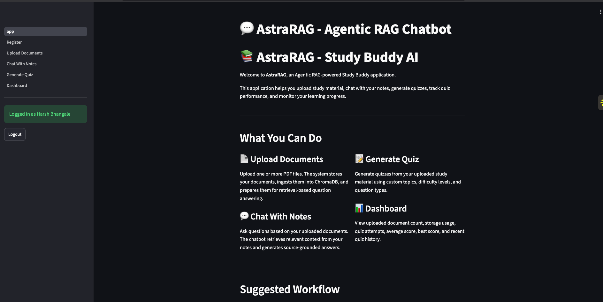
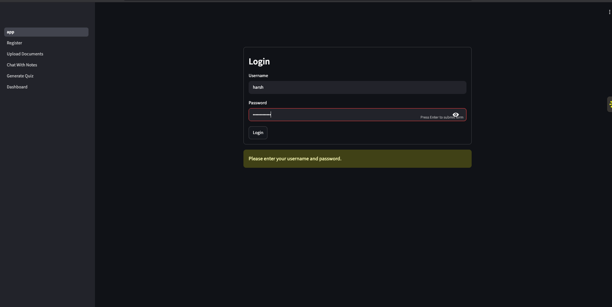
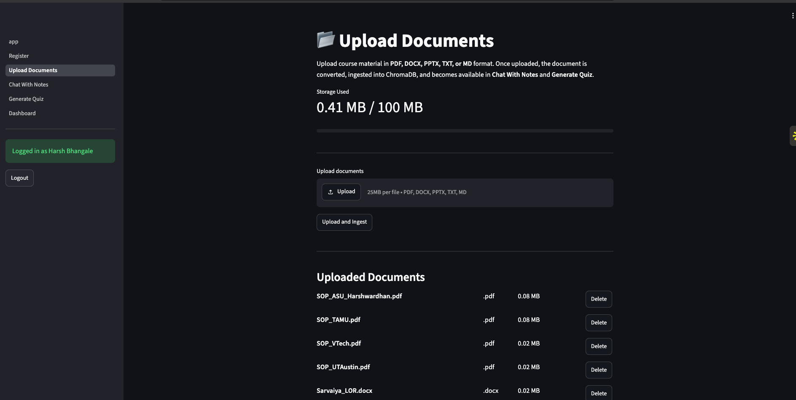
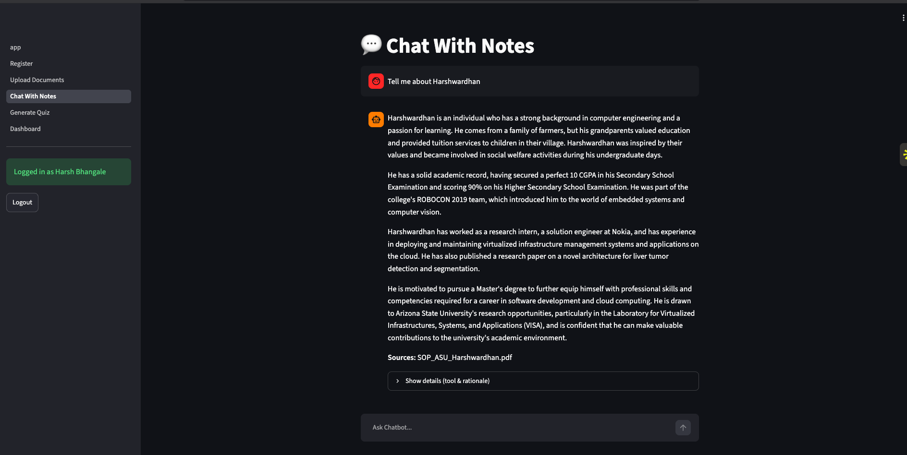
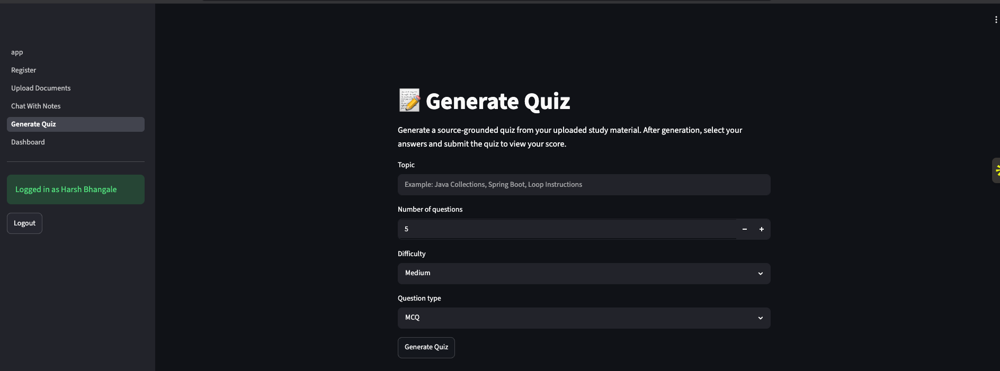
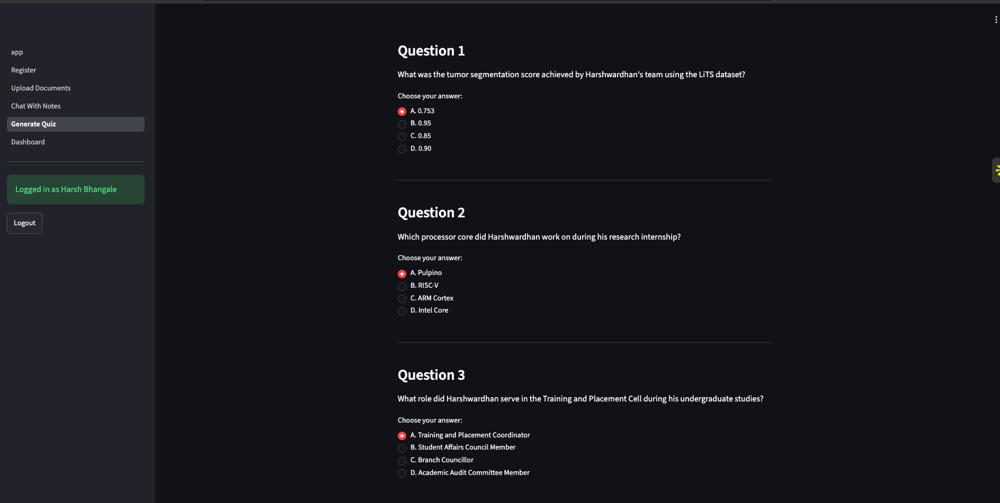
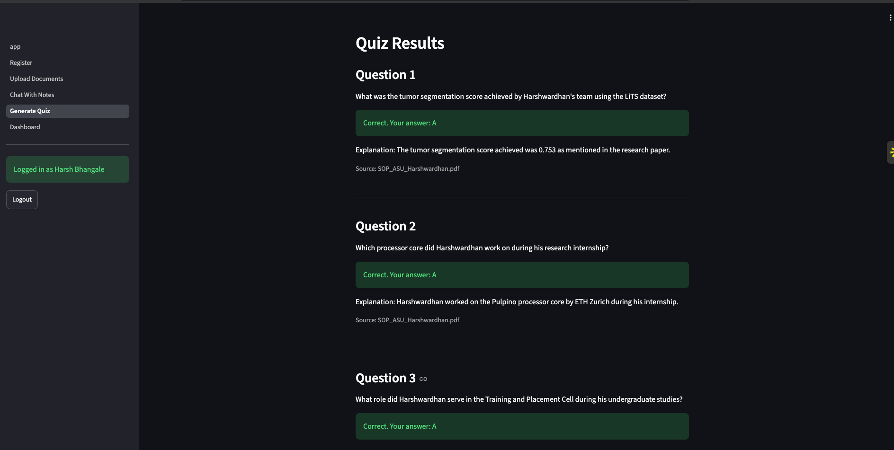
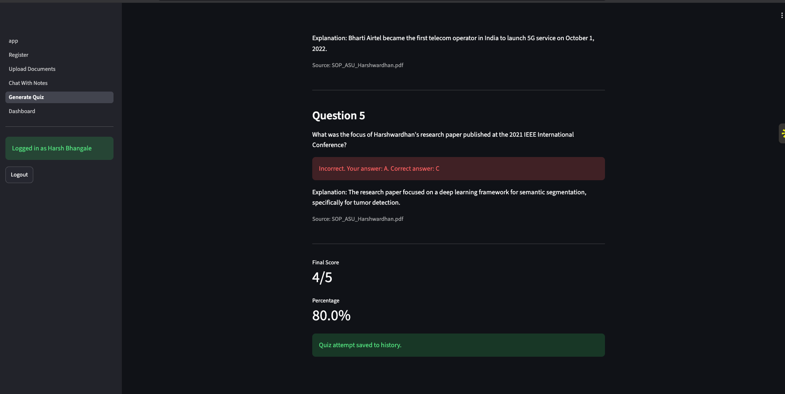
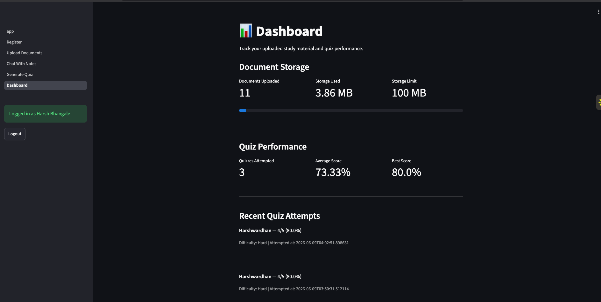

# AstraRAG — Agentic RAG Study Buddy AI

AstraRAG is a full-stack **Agentic Retrieval-Augmented Generation Study Buddy** application that allows users to upload study material, chat with their documents, generate source-grounded quizzes, track quiz performance, and monitor system behavior using Prometheus and Grafana.

The project evolved from a basic RAG chatbot into a complete cloud-native application with:

- Streamlit frontend
- FastAPI backend
- User authentication
- Document upload and ingestion
- ChromaDB vector storage
- LlamaIndex retrieval
- CrewAI agent orchestration
- Quiz generation and scoring
- Persistent user document storage
- Prometheus metrics
- Grafana dashboard provisioning
- Dockerized deployment
- Kubernetes manifests
- Jenkins CI pipeline
- ArgoCD GitOps deployment

---

## Table of Contents

- [Project Overview](#project-overview)
- [Application Screenshots](#application-screenshots)
- [Core Features](#core-features)
- [System Architecture](#system-architecture)
- [Tech Stack](#tech-stack)
- [Project Structure](#project-structure)
- [Local Setup with Docker Compose](#local-setup-with-docker-compose)
- [Manual Local Development Setup](#manual-local-development-setup)
- [Environment Variables](#environment-variables)
- [API and Service URLs](#api-and-service-urls)
- [Kubernetes and GitOps Deployment](#kubernetes-and-gitops-deployment)
- [CI/CD Pipeline](#cicd-pipeline)
- [Observability with Prometheus and Grafana](#observability-with-prometheus-and-grafana)
- [Persistent Storage](#persistent-storage)
- [Useful Commands](#useful-commands)
- [Troubleshooting](#troubleshooting)
- [Future Improvements](#future-improvements)
- [Author](#author)

---

## Project Overview

AstraRAG is designed as an AI-powered study assistant.

Users can:

1. Register and log in.
2. Upload PDF, DOCX, PPTX, TXT, or Markdown study documents.
3. Ingest uploaded files into a user-specific vector database.
4. Ask questions over their uploaded notes.
5. Generate quizzes from uploaded material.
6. Attempt quizzes and view scores.
7. Track document usage, storage, and quiz history.
8. Monitor backend metrics through Prometheus and Grafana.

The application is built around the idea of **source-grounded learning**. Instead of answering from general model knowledge only, the system retrieves relevant document chunks and generates answers or quizzes using the uploaded study material as context.

---

## Application Screenshots

### Home Page

The landing page introduces AstraRAG as an Agentic RAG-powered Study Buddy application.



---

### Login

Users can log in with a username and password. The current implementation supports user-specific document storage and quiz history.



---

### Upload Documents

Users can upload study material. Uploaded documents are stored persistently and ingested into ChromaDB for retrieval.



---

### Chat With Notes

The chat interface allows users to ask questions about uploaded documents. Answers are generated using retrieved document context and include source attribution.



---

### Generate Quiz

Users can generate quizzes from uploaded study material by specifying a topic, number of questions, difficulty, and question type.



---

### Quiz Attempt

Generated questions are displayed as multiple-choice questions. Users can select answers and submit the quiz.



---

### Quiz Results

After submission, the application shows correctness, explanations, sources, score, and percentage.





---

### User Dashboard

The dashboard tracks uploaded documents, storage usage, quiz attempts, average score, best score, and recent quiz history.



---

## Core Features

### 1. User Authentication

AstraRAG supports user-level access so uploaded documents, vector stores, and quiz history are separated per user.

Each user has isolated storage paths similar to:

```text
/app/data/users/{user_id}/uploads
/app/data/users/{user_id}/chroma
```
